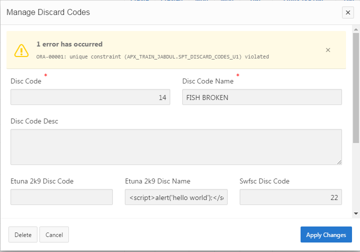
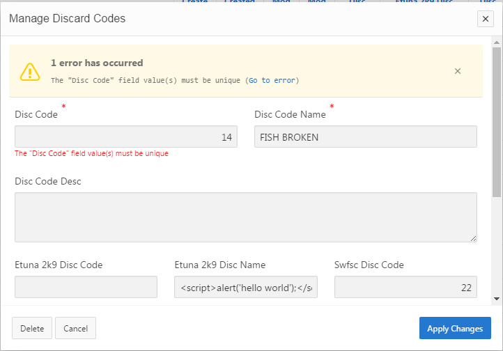
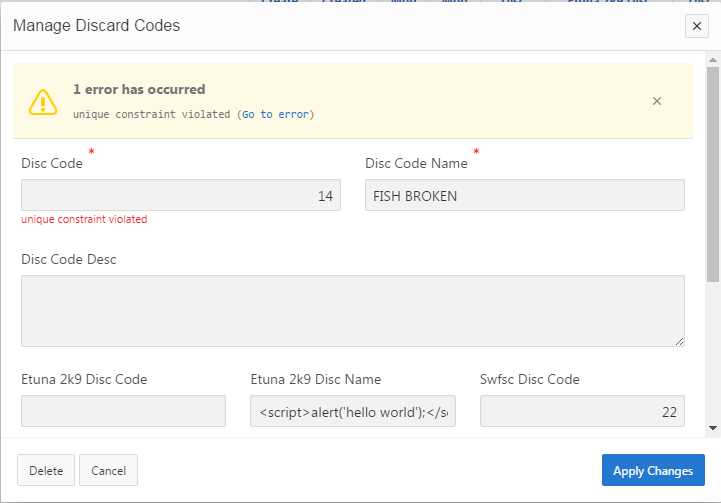

# APEX Security Documentation - Error Handling

## Overview:
Various security controls are implemented in APEX applications by default to prevent different types of malicious attacks. This document provides information on some different attack methods and the corresponding security controls in place to prevent them. SI-11 is a security requirement communicated by the PIFSC ISSO.

## SI-11 - Error Handling:
-   Control: The information system:
> a\. Generates error messages that provide information necessary for corrective actions without revealing information that could be exploited by adversaries; and
b.  Reveals error messages only to \[Assignment: organization-defined personnel or roles\].
-   Supplemental Guidance: Organizations carefully consider the structure/content of error messages. The extent to which information systems are able to identify and handle error conditions is guided by organizational policy and operational requirements. Information that could be exploited by adversaries includes, for example, erroneous logon attempts with passwords entered by mistake as the username, mission/business information that can be derived from (if not stated explicitly by) information recorded, and personal information such as account numbers, social security numbers, and credit card numbers. In addition, error messages may provide a covert channel for transmitting information. Related controls: AU-2, AU-3, SC-31.
-   Control Enhancements: None.
-   References: None.
-   Priority and Baseline Allocation:
-   Attack Overview: Malicious users could experiment with form inputs that generate error messages in the given application. If these error messages provide technical details those could potentially be used to launch directed attacks at the underlying servers.
    -   Additional Information: https://owasp.org/www-community/Improper_Error_Handling
-   Prevention Control: [Global Custom Error Handling Module](https://gitlab.pifsc.gov/centralized-data-tools/apex_tools/-/tree/master/Error%20Handling) (Git: git@gitlab.pifsc.gov:centralized-data-tools/apex_tools.git in the "Error Handling" folder) implemented for all APEX application pages. There is a PL/SQL function that has been developed to suppress error message details on all application instances except for midd.pic.gov since it is explicitly defined as a development environment only and therefore not subject to the same constraints.
    -   Examples of security control implementation:
        -   The error handling function will check a user-defined table to see if there is a matching constraint name for the given database error and if so it will use that custom error message (shown in [Fig 4-2](#fig.-4-2)). If there is no matching user-defined custom error message a generic error message is used instead (shown in [Fig 4-3](#fig.-4-3)) that does not include structural information. The default APEX framework functionality is shown in [Fig 4-1](#fig.-4-1) which presents a security problem and the only application platform that will be allowed to view the detailed error code/description is midd.pic.gov because this information is useful for development purposes.

### Fig. 4-1
(default error handling)

### Fig. 4-2
(custom error handling)

### Fig. 4-3
(custom error handling without an explicit matching custom error message)

