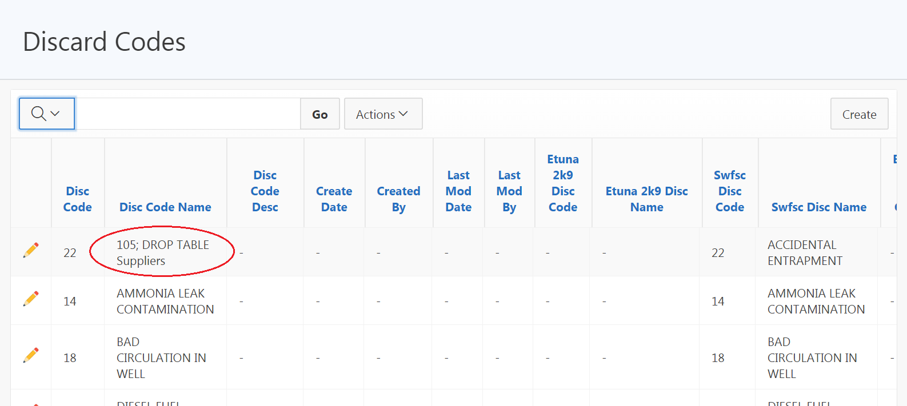

# APEX Security Documentation - Information Input Validation

## Overview:
Various security controls are implemented in APEX applications by default to prevent different types of malicious attacks. This document provides information on some different attack methods and the corresponding security controls in place to prevent them. SI-10 is a security requirement communicated by the PIFSC ISSO.

## SI-10 - Information Input Validation:
-   Control: The information system checks the validity of \[Assignment: organization-defined information inputs\].
-   Supplemental Guidance: Checking the valid syntax and semantics of information system inputs (e.g., character set, length, numerical range, and acceptable values) verifies that inputs match specified definitions for format and content. Software applications typically follow well-defined protocols that use structured messages (i.e., commands or queries) to communicate between software modules or system components. Structured messages can contain raw or unstructured data interspersed with metadata or control information. If software applications use attacker- supplied inputs to construct structured messages without properly encoding such messages, then the attacker could insert malicious commands or special characters that can cause the data to be interpreted as control information or metadata. Consequently, the module or component that receives the tainted output will perform the wrong operations or otherwise interpret the data incorrectly. Prescreening inputs prior to passing to interpreters prevents the content from being unintentionally interpreted as commands. Input validation helps to ensure accurate and correct inputs and prevent attacks such as cross-site scripting and a variety of injection attacks.
-   ### Attack Method: SQL Injection
    -   Attack Overview: "A [SQL injection](https://owasp.org/www-community/attacks/SQL_Injection) attack consists of insertion or "injection" of a SQL query via the input data from the client to the application. A successful SQL injection exploit can read sensitive data from the database, modify database data (Insert/Update/Delete), execute administration operations on the database (such as shutdown the DBMS), recover the content of a given file present on the DBMS file system and in some cases issue commands to the operating system. SQL injection attacks are a type of [injection attack](https://www.owasp.org/index.php/Top_10_2007-Injection_Flaws), in which SQL commands are injected into data-plane input in order to effect the execution of predefined SQL commands."
        -   Additional information: https://owasp.org/www-community/attacks/SQL_Injection
    -   Threat Modeling:
        -   SQL injection attacks allow attackers to spoof identity, tamper with existing data, cause repudiation issues such as voiding transactions or changing balances, allow the complete disclosure of all data on the system, destroy the data or make it otherwise unavailable, and become administrators of the database server.
        -   SQL Injection is very common with PHP and ASP applications due to the prevalence of older functional interfaces. Due to the nature of programmatic interfaces available, J2EE and ASP.NET applications are less likely to have easily exploited SQL injections.
        -   The severity of SQL Injection attacks is limited by the attacker’s skill and imagination, and to a lesser extent, defense in depth countermeasures, such as low privilege connections to the database server and so on. In general, consider SQL Injection a high impact severity.
    -   Prevention Controls: Query Parameterization
        -   APEX data management applications
            -   Wizard-based data management forms are implemented using the default APEX functionality. When the standard “Process Row” process is executed the record operations are automatically handled for all form fields using Query Parameterization so that each form field value is treated as a value in the SQL statement and the content will never be executed as part of a larger SQL statement. When custom SQL code is used and contains a user-defined parameter (e.g. form field value) the statement is constructed to explicitly define the bind variables and define the values when the given query/PL/SQL code is executed.
            -   Examples of security control implementation:
                -   [Fig. 2-1](#fig-2-1) shows an example of a common SQL injection attack type that was made on a typical APEX data management form. The attacker attempts to inject additional SQL statements that will be executed as part of the larger database query. [Fig. 2-2](#fig-2-2) shows that the attack was unsuccessful and that the database object was not dropped and instead the SQL statement was treated as a form field value.
-   ### Attack Method: Cross Site Scripting
    -   Attack Overview: “Cross-Site Scripting (XSS) attacks are a type of injection, in which malicious scripts are injected into otherwise benign and trusted web sites. XSS attacks occur when an attacker uses a web application to send malicious code, generally in the form of a browser side script, to a different end user. Flaws that allow these attacks to succeed are quite widespread and occur anywhere a web application uses input from a user within the output it generates without validating or encoding it. An attacker can use XSS to send a malicious script to an unsuspecting user. The end user’s browser has no way to know that the script should not be trusted, and will execute the script. Because it thinks the script came from a trusted source, the malicious script can access any cookies, session tokens, or other sensitive information retained by the browser and used with that site. These scripts can even rewrite the content of the HTML page. For more details on the different types of XSS flaws, see: Types of Cross-Site Scripting.”
    -   Additional Information: https://www.owasp.org/index.php/Cross-site_Scripting_(XSS)
    -   Prevention Controls: Convert to HTML Entities Before displaying in web page
        -   Each database value that is displayed in the web application is converted to its corresponding HTML entities so that the HTML will display correctly on the page but the code will be unable to execute because all of the HTML control characters will be converted to their corresponding HTML entity (e.g. converting & to &amp;).
            -   APEX data management applications
                -   In APEX the “Escape special characters” security setting is enabled by default and it causes each of the corresponding database result set field values to be converted to their corresponding HTML entities before displaying the content in the page which renders potentially injected client-side code harmless.
                -   Examples of security control implementation:
                    -   [Fig. 3-1](#fig-3-1) shows a simple XSS attack by injecting executable HTML code in a standard APEX form with “Escape special characters” setting enabled. [Fig. 3-2](#fig-3-2) shows the HTML code displayed correctly on the web page. [Fig. 3-3](#fig-3-3) shows the underlying source code of the HTML page shown in [Fig. 3-2](#fig-3-2) that has had its values converted to prevent the HTML code from actually being executed by the browser.

### Fig. 2-1
(example of a SQL Injection Attack) - This screenshot shows a common SQL injection attack that attempts to add an additional database query to be executed when a record save operation is attempted

### Fig. 2-2
(SQL Injection Attack Results) - This screenshot shows that the attack attempt was treated as a form field value that was used to set the database field value instead of actually executing the statement:

### Fig. 3-1
(APEX XSS attack example) - This screenshot shows a simple XSS attack attempt to inject Javascript code into the database with the intent that the HTML code will execute each time it is displayed on the page and attempt to compromise the user’s web browser.

### Fig. 3-2
(APEX XSS screenshot) - This screenshot shows the HTML entered by the XSS attack displayed on a web page and displayed correctly. This code does not actually execute in the web browser

### Fig. 3-3
(XSS attack mitigation by APEX security settings) - This screenshot shows the source code of the web page shown in Fig. 3-2 that has converted the HTML code into its corresponding HTML entities that prevents the injected HTML code from being executed in the web browser:

